# TeamCity and Xamarin Android - the right way!

In this article I will show you how to:
* use `appsettings.json` and `AndroidManifest.xml` based on `Configuration`
* create `apk` files from Visual Studio
* create an `apk` from command line
* set up a TeamCity for your project

**Assumptions**
* you have basic knowlage on developing xamarin android app in Visual Studio
* you have your teamcity already running

## Configurations


Go to `Configuration Manager` and create 3 new coonfigurations: DEV, STAGE, PROD. **Remember to copy setting from `Release` because debugging is turned off there.**
<p align="center">
    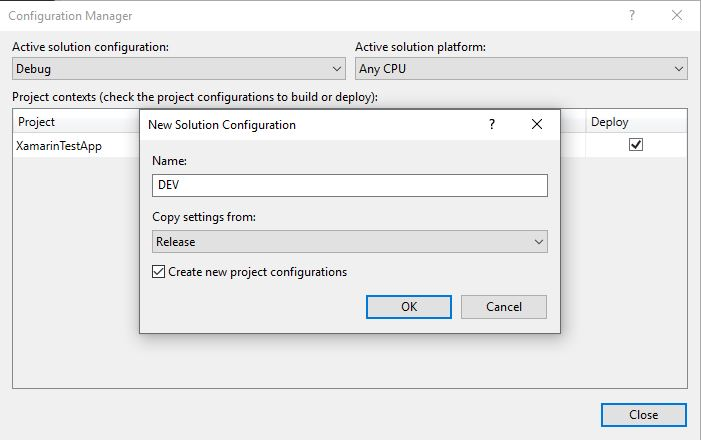
</p>

## Reading data from `AndroidManifest.xml`

You may ask - *why to use different `AndroidManifest.xml`?*. Answer is easy - if you want to deploy your DEV, STAGE and PROD version of your app to Google Play each of them mush have different name.
Name of an app is stored in `AndroidManifest.xml` so you must have one of them for each app.

This part is the easiest. Go to `content_main.axml` and create a new `TextView`.

```
<TextView
    android:layout_width="wrap_content"
    android:layout_height="wrap_content"
    android:id="@+id/textview_appName"/>
```

Go to `MainActivity.cs` and add this to `OnCreate` method:
```
    TextView textview_appName = FindViewById<TextView>(Resource.Id.textview_appName);
    textview_appName.Text = $"PackageName: {PackageName.Split('.').ToList().Last()}";
```
After running an application on screen you will have the same value as you have in `AndroidManifest.xml` -> manifest tag -> package attribute.
<p align="center">
    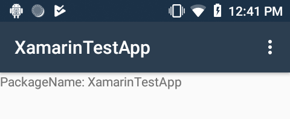
</p>

### Multiple `AndroidManifest.xml` files

Go to `Properties` folder (you `AndroidManifest.xml` is already there) and create 3 additional folders: DEV, STAGE, PROD
and copy yours current `AndroidManifest.xml` to each of those. Edit each file and change manifest tag -> package attribute in DEV and STAGE folder to: 
* com.companyname.XamarinTestApp_DEV
* com.companyname.XamarinTestApp_ STAGE
* com.companyname.XamarinTestApp_ PROD

Now unload your project and edit `.csproj` file and add `<AndroidManifest></AndroidManifest>` to each of PropertyGroup with a right path to your `AndfoidManifest` files
It should look like the one below now.

```
<PropertyGroup Condition="'$(Configuration)|$(Platform)' == 'DEV|AnyCPU'">
...
<AndroidManifest>Properties\DEV\AndroidManifest.xml</AndroidManifest>
</PropertyGroup>
<PropertyGroup Condition="'$(Configuration)|$(Platform)' == 'STAGE|AnyCPU'">
...
<AndroidManifest>Properties\STAGE\AndroidManifest.xml</AndroidManifest>
</PropertyGroup>
<PropertyGroup Condition="'$(Configuration)|$(Platform)' == 'PROD|AnyCPU'">
...
<AndroidManifest>Properties\PROD\AndroidManifest.xml</AndroidManifest>
</PropertyGroup>
```

Now change your configuration do DEV, STAGE and PROD and check app name on a screen.
<p align="center">
    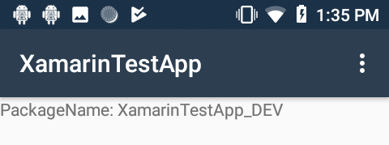
    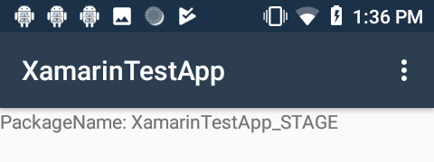
    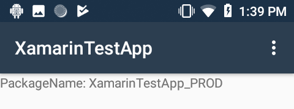
</p>

## Reading data from `appsetting.json`

If you have your own way to read data from this file that is fine bot for those tho don't I will give a piece of code with come minimal explonation.
1) go to Assets folder and creare `appsettings.json` file with this content
```
{
  "Version": "Debug"
}
```
2) create an interface `IAppSettings`
```
public interface IAppSettings
{
    string Version { get; set; }
}
```
and class `AppSettings`
```
public class AppSettings : IAppSettings
{
    public string Version { get; set; }
}
```
3) create interface `IAppSettingsManager`
```
public interface IAppSettingsManager
{
    IAppSettings GetConfig();
}
```
and class `AppSettingsManager`
```
using Android.Content.Res;
using Newtonsoft.Json;
using System.IO;

public class AppSettingsManager : IAppSettingsManager
{
    const string _appSettingsFileName = "appsettings.json";

    private readonly AssetManager _manager;

    public AppSettingsManager(AssetManager manager)
    {
        _manager = manager;
    }

    public IAppSettings GetConfig()
    {
        using (var sr = new StreamReader(_manager.Open(_appSettingsFileName)))
        {
            var content = sr.ReadToEnd();
            var configuration = JsonConvert.DeserializeObject<AppSettings>(content);
            return configuration;
        }
    }
}
```
4) I'm using `Autofac` for dependency injection so mu `App.cs` file looks like that
```
using Android.App;
using Android.Runtime;
using Autofac;
using Autofac.Extras.CommonServiceLocator;
using CommonServiceLocator;
using System;

[Application]
public class App : Application
{
    public App(IntPtr handle, JniHandleOwnership transfer) : base(handle, transfer) { }

    public override void OnCreate()
    {
        var containerBuilder = new ContainerBuilder();
        ConfigureContainer(containerBuilder);
        var container = containerBuilder.Build();
        ServiceLocator.SetLocatorProvider(() => new AutofacServiceLocator(container));

        base.OnCreate();
    }

    private void ConfigureContainer(ContainerBuilder containerBuilder)
    {
        containerBuilder.Register(c => new AppSettingsManager(this.Assets))
            .As<IAppSettingsManager>();

        containerBuilder.Register(c =>
        {
            var mgr = c.Resolve<IAppSettingsManager>();
            return mgr.GetConfig();
        }).As<IAppSettings>();
    }
}
```

I have registered a set for `AppSettingsManager` and `AppSettings`
5) And the last class `DependencyResolver`
```
using Autofac;
using Autofac.Extras.CommonServiceLocator;
using CommonServiceLocator;
public static class DependencyResolver
{
    public static T Get<T>()
    {
        var serviceLocator = (AutofacServiceLocator)ServiceLocator.Current;
        var ctx = serviceLocator.GetInstance<IComponentContext>();
        return ctx.Resolve<T>();
    }
}
```
6) Now we are ready to red data from `appsetting.json` file so add new `TextView` to your `content_main.axml` below `textview_appSettings`
```
<TextView
    android:layout_width="wrap_content"
    android:layout_height="wrap_content"
    android:id="@+id/textview_appSettings"/>
```

and add this in in `MainActivity` in `OnCreate` method
```
    TextView textview_appSettings = FindViewById<TextView>(Resource.Id.textview_appSettings);
    var version = DependencyResolver.Get<IAppSettings>().Version;
    textview_appSettings.Text = $"AppSettings: {version}";
```

Now when you run your app you should see additional line this on your screen

<p align="center">
    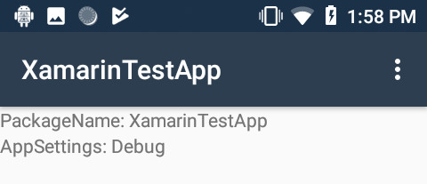
</p>

### Multiple `appsetting.json` files

Go to Assets folder and create 4 new folders (Debug, DEV, STAGE, PROD) and copy `appsetting.json` to each of them.
Change value of `Version` to match folder name. Unload project and edit `csproj` file because we have to add `CopyTask` that will be triggeres not only
before build but just after all the files are copied to build directory. If you thing that this will solve your problem

```
  <Target Name="CopyConfigFiles" BeforeTargets="Build">
    <Delete Files="$(MSBuildProjectDirectory)/Assets/appsettings.json" />
    <Copy SourceFiles="$(MSBuildProjectDirectory)/Assets/$(Configuration)/appsettings.json" DestinationFolder="$(MSBuildProjectDirectory)/Assets/" />
  </Target>
```
Then you are wrong. This will happen before build but after MSBuild copy all filed to a build directory so it will work for second build which is pointless.

<p align="center">
    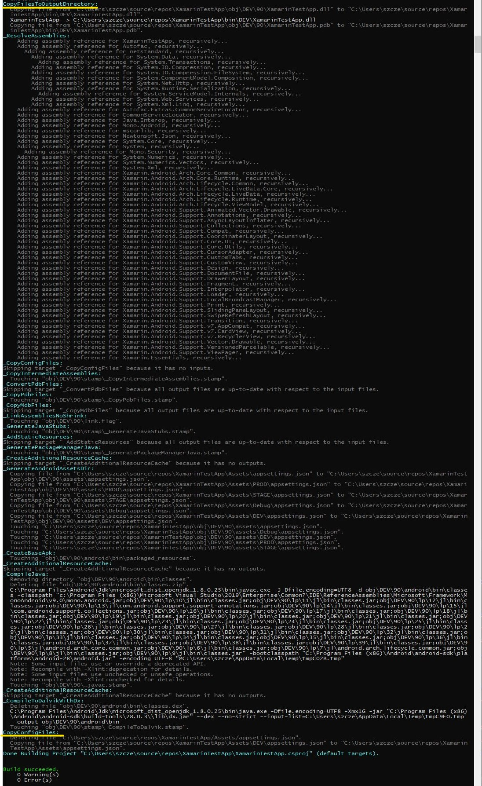
</p>

Everything is already copied to `\obj\${Configuration}\90` directory before our `CopyConfigFiles` task is triggered so we have to add new PropertyGroup like here:

```
  <PropertyGroup>
    <PrepareForRunDependsOn>$(PrepareForRunDependsOn);CopyConfigFiles</PrepareForRunDependsOn>
  </PropertyGroup>
  <ProjectExtensions />
  <Target Name="CopyConfigFiles">
    <Delete Files="$(MSBuildProjectDirectory)/Assets/appsettings.json" />
    <Copy SourceFiles="$(MSBuildProjectDirectory)/Assets/$(Configuration)/appsettings.json" DestinationFolder="$(MSBuildProjectDirectory)/Assets/" />
  </Target>
```

<p align="center">
    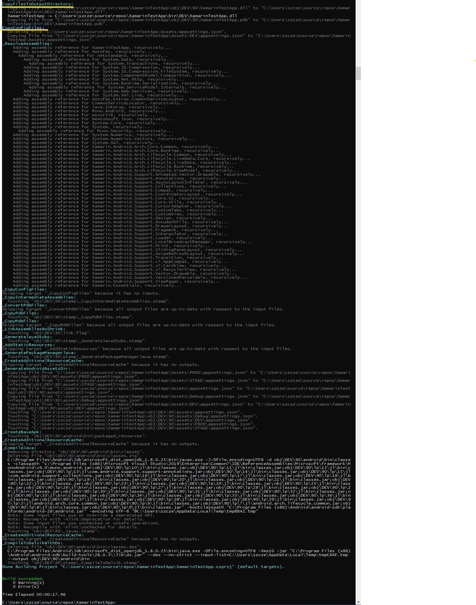
</p>

And now it is fine. Change your `Configuration` and run apps. You should now see values from correct `appsetting.json`
<p align="center">
    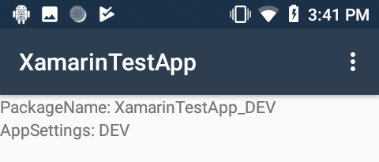
    
    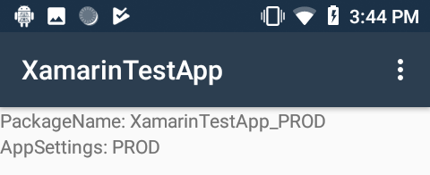
</p>

Great, out solutions are working so now we have to create a package from Visual Studio and check if it is still working.

## Create package from Visual Studio and run on device

1) open properties of your project, go to Android Options and unselect "Use Shared runtime" for DEV, STAGE and PROD configuration.
2) click right on the project and select `Archive` 
3) when it is complere you should see `Distribute` button on the right so click it
4) select `Ad Hoc`
5) create a key (remember password because you will be asked to use id)
<p align="center">
    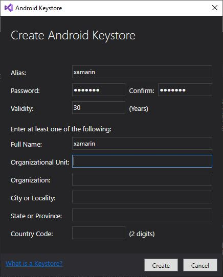
</p>

6) `Save as`
7) `Save`
8) and `Open Folder`
<p align="center">
    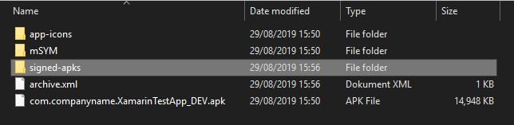
</p>

9) copy an `apk` from `signed-aps` folder and paste it to your device 
10) install the `apk` on your device and check if everything is working as before

## Create package from command line and run on device

1) go to Android Options > Debugging Options. UNCKECK the Enable Developer Instrumentation box.

2) before you run MSBuild from command line you have to unload projest, edit `csproj` file and paste is on the bottom
```
  <Target Name="PackageAndroidApk_DEV">
    <MSBuild Projects="$(MSBuildProjectDirectory)\XamarinTestApp.csproj" Targets="PackageForAndroid" Properties="Configuration=DEV">
    </MSBuild>
  </Target>
  <Target Name="PackageAndroidApk_STAGE">
    <MSBuild Projects="$(MSBuildProjectDirectory)\XamarinTestApp.csproj" Targets="PackageForAndroid" Properties="Configuration=STAGE">
    </MSBuild>
  </Target>
  <Target Name="PackageAndroidApk_PROD">
    <MSBuild Projects="$(MSBuildProjectDirectory)\XamarinTestApp.csproj" Targets="PackageForAndroid" Properties="Configuration=PROD">
    </MSBuild>
  </Target>
```
because you will not get an `apk` file straight away
3) open command line and run MSBuild with `Configuration` parameter and `PackageAndroidApk_DEV` target
```
"c:\Program Files (x86)\Microsoft Visual Studio\2019\Enterprise\MSBuild\Current\Bin\MSBuild.exe" XamarinTestApp.csproj /p:Configuration=DEV /t:PackageAndroidApk_DEV
```
your `apk` file should appear in `\bin\DEV\` folder

### Signing an app

Now we have to signed this file so we have to find out keys that we created some time ago
4) Go to `C:\Users\{YourUserName}\AppData\Local\Xamarin\Mono for Android\Keystore` and find a keystore you have created
5) copy both filed to your project directory
6) use `jarsigner` to sing an app

`"c:\Program Files\Android\jdk\microsoft_dist_openjdk_1.8.0.25\bin\jarsigner.exe" -verbose -sigalg md5withRSA -digestalg SHA1 -keystore xamarin.keystore -storepass xamarin -keypass xamarin -signedjar bin\DEV\com.companyname.XamarinTestApp_DEV-signed.apk bin\DEV\com.companyname.XamarinTestApp_DEV.apk xamarin`
* keystore - name of your file
* storepass - password that you have chosen
* keypass - the same password
* signedjar - path to `apk` signed file 

A new file `com.companyname.XamarinTestApp_DEV-signed.apk` should appear in the same folder

### ZIPAligning

The last step if to ZIPAligne this file. To do so use this command
`"c:\Program Files (x86)\Android\android-sdk\build-tools\28.0.3\zipalign.exe" -f -v 4 bin\DEV\com.companyname.XamarinTestApp_DEV-signed.apk bin\DEV\com.companyname.XamarinTestApp_DEV-zipaligned.apk`

Ok a final file is awailable to distribute to your device. Please check if this one is working as all previous.

## TeamCity