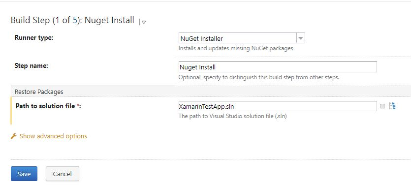
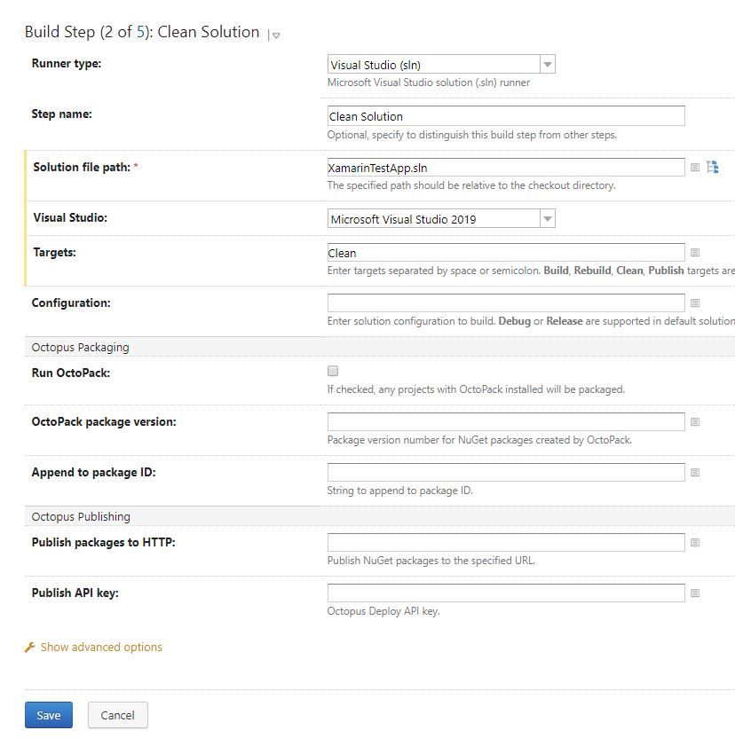
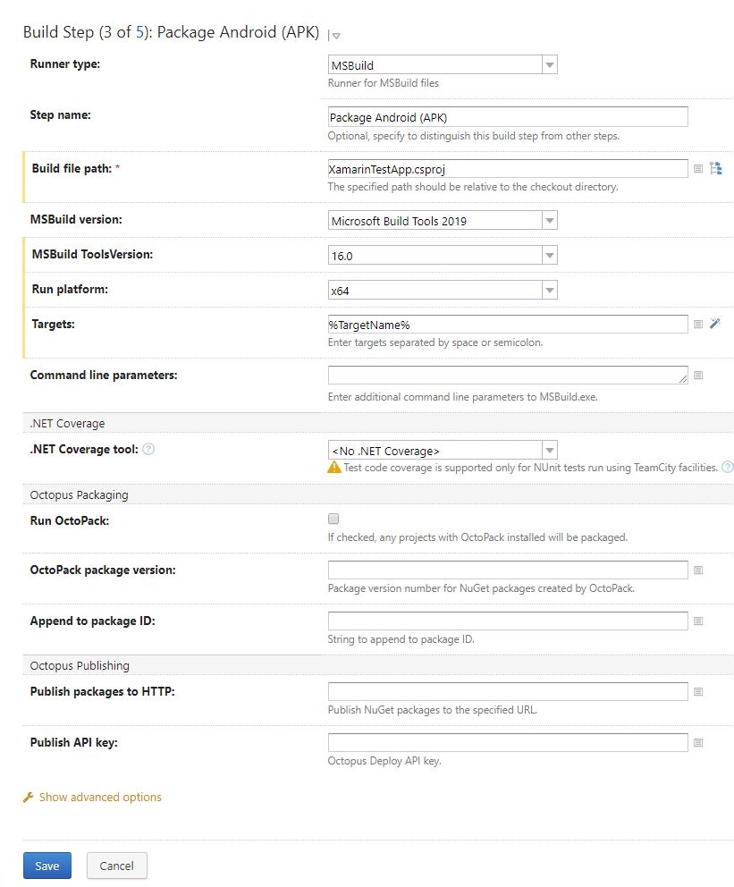
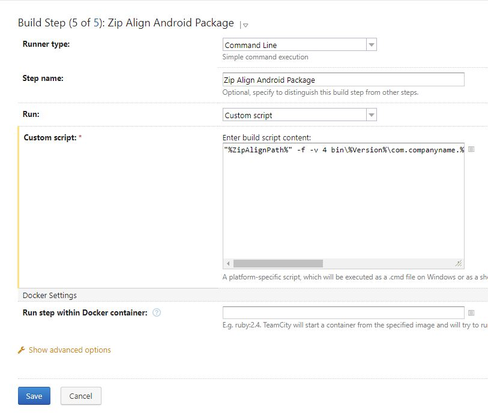

# TeamCity and Xamarin Android - the right way!

It is not an easy job to create a project that works the same way for local and on any Continues integration tool. 
Team City is a great tool but it doesn't have build-in plugins for Xamarin Android so we will have to move locally tested commands to build steps.

In this article I will show you how to:
* use `appsettings.json` and `AndroidManifest.xml` based on `Configuration`
* create `apk` files from Visual Studio
* create an `apk` from the command line
* set up a TeamCity for your project

**Assumptions**
* you have basic knowledge on developing Xamarin Android app in Visual Studio
* you have your TeamCity already up running

## Configurations

We need more than one `Configuration` to determinate which `appsettings.json` and `AndroidManifest.xml` to use so go to `Configuration Manager` and create 3 new configurations: DEV, STAGE, PROD. **Remember to copy setting from `Release` because debugging is turned off there.**
<p align="center">
    
</p>

## Reading data from `AndroidManifest.xml`

This part is the easiest just go to `content_main.axml` and create a new `TextView`.

```
<TextView
    android:layout_width="wrap_content"
    android:layout_height="wrap_content"
    android:id="@+id/textview_appName"/>
```

Go to `MainActivity.cs` and add this to `OnCreate` method:
```
    TextView textview_appName = FindViewById<TextView>(Resource.Id.textview_appName);
    textview_appName.Text = $"PackageName: {PackageName.Split('.').ToList().Last()}";
```
After running an application on screen you will have the same value as you have in `AndroidManifest.xml` -> `manifest` tag -> `package` attribute.
<p align="center">
    
</p>

### Multiple `AndroidManifest.xml` files
You may ask - *why to use different `AndroidManifest.xml`?* The answer is easy - if you want to deploy your DEV, STAGE and PROD version of your app to Google Play each of them must have a different name.Name of an app is stored in `AndroidManifest.xml` so you must have one of them for each app.

Go to `Properties` folder (you `AndroidManifest.xml` is already there) and create 3 additional folders: DEV, STAGE, PROD
and copy yours current `AndroidManifest.xml` to each of those. Edit each file and change `manifest` tag -> `package` attribute in DEV, STAGE and PROD folder to: 
* com.companyname.XamarinTestApp_DEV
* com.companyname.XamarinTestApp_ STAGE
* com.companyname.XamarinTestApp_ PROD

Now unload your project and edit `.csproj` file and add `<AndroidManifest></AndroidManifest>` to each of PropertyGroup with a right path to your `AndfoidManifest` files.
It should look like the one below.

```
<PropertyGroup Condition="'$(Configuration)|$(Platform)' == 'DEV|AnyCPU'">
...
<AndroidManifest>Properties\DEV\AndroidManifest.xml</AndroidManifest>
</PropertyGroup>
<PropertyGroup Condition="'$(Configuration)|$(Platform)' == 'STAGE|AnyCPU'">
...
<AndroidManifest>Properties\STAGE\AndroidManifest.xml</AndroidManifest>
</PropertyGroup>
<PropertyGroup Condition="'$(Configuration)|$(Platform)' == 'PROD|AnyCPU'">
...
<AndroidManifest>Properties\PROD\AndroidManifest.xml</AndroidManifest>
</PropertyGroup>
```

Now change your configuration do DEV, STAGE and PROD, run an app and check app name on a screen.
<p align="center">
    
    
    
</p>

## Reading data from `appsetting.json`

If you have your own way to read data from this file that is fine but for those who don't I will give a piece of code with some minimal explanation.
1) go to Assets folder and create `appsettings.json` file with this content
```
{
  "Version": "Debug"
}
```
2) create an interface `IAppSettings`
```
public interface IAppSettings
{
    string Version { get; set; }
}
```
and class `AppSettings`
```
public class AppSettings : IAppSettings
{
    public string Version { get; set; }
}
```
3) create interface `IAppSettingsManager`
```
public interface IAppSettingsManager
{
    IAppSettings GetConfig();
}
```
and class `AppSettingsManager`
```
using Android.Content.Res;
using Newtonsoft.Json;
using System.IO;

public class AppSettingsManager : IAppSettingsManager
{
    const string _appSettingsFileName = "appsettings.json";

    private readonly AssetManager _manager;

    public AppSettingsManager(AssetManager manager)
    {
        _manager = manager;
    }

    public IAppSettings GetConfig()
    {
        using (var sr = new StreamReader(_manager.Open(_appSettingsFileName)))
        {
            var content = sr.ReadToEnd();
            var configuration = JsonConvert.DeserializeObject<AppSettings>(content);
            return configuration;
        }
    }
}
```
4) I'm using `Autofac` for dependency injection so my `App.cs` file looks like that
```
using Android.App;
using Android.Runtime;
using Autofac;
using Autofac.Extras.CommonServiceLocator;
using CommonServiceLocator;
using System;

[Application]
public class App : Application
{
    public App(IntPtr handle, JniHandleOwnership transfer) : base(handle, transfer) { }

    public override void OnCreate()
    {
        var containerBuilder = new ContainerBuilder();
        ConfigureContainer(containerBuilder);
        var container = containerBuilder.Build();
        ServiceLocator.SetLocatorProvider(() => new AutofacServiceLocator(container));

        base.OnCreate();
    }

    private void ConfigureContainer(ContainerBuilder containerBuilder)
    {
        containerBuilder.Register(c => new AppSettingsManager(this.Assets))
            .As<IAppSettingsManager>();

        containerBuilder.Register(c =>
        {
            var mgr = c.Resolve<IAppSettingsManager>();
            return mgr.GetConfig();
        }).As<IAppSettings>();
    }
}
```

I have registered a set of `AppSettingsManager` and `AppSettings`
5) And the last class `DependencyResolver`
```
using Autofac;
using Autofac.Extras.CommonServiceLocator;
using CommonServiceLocator;
public static class DependencyResolver
{
    public static T Get<T>()
    {
        var serviceLocator = (AutofacServiceLocator)ServiceLocator.Current;
        var ctx = serviceLocator.GetInstance<IComponentContext>();
        return ctx.Resolve<T>();
    }
}
```
6) Now we are ready to read data from `appsetting.json` file so add new `TextView` to your `content_main.axml` below `textview_appSettings`
```
<TextView
    android:layout_width="wrap_content"
    android:layout_height="wrap_content"
    android:id="@+id/textview_appSettings"/>
```

and add this in in `MainActivity` in `OnCreate` method
```
    TextView textview_appSettings = FindViewById<TextView>(Resource.Id.textview_appSettings);
    var version = DependencyResolver.Get<IAppSettings>().Version;
    textview_appSettings.Text = $"AppSettings: {version}";
```

Now when you run your app you should see an additional line this on your screen.

<p align="center">
    
</p>

### Multiple `appsetting.json` files

Go to Assets folder and create 4 new folders (Debug, DEV, STAGE, PROD) and copy `appsetting.json` to each of them.
Change the value of `Version` to match folder name. Unload project and edit `csproj` file because we have to add `Copy` task that will be triggered not only
before build but just after all the files are copied to build directory. If you think that this will solve your problem.
Then you are wrong. This will happen before the build but after all files are copied to a build directory so it will work for the second build which is pointless.

```
  <Target Name="CopyConfigFiles" BeforeTargets="Build">
    <Delete Files="$(MSBuildProjectDirectory)/Assets/appsettings.json" />
    <Copy SourceFiles="$(MSBuildProjectDirectory)/Assets/$(Configuration)/appsettings.json" DestinationFolder="$(MSBuildProjectDirectory)/Assets/" />
  </Target>
```

<p align="center">
    
</p>

Everything is already copied to `\obj\${Configuration}\90` directory before our `CopyConfigFiles` task is triggered so we have to add new `PropertyGroup` that should look like the one below:

```
  <PropertyGroup>
    <PrepareForRunDependsOn>$(PrepareForRunDependsOn);CopyConfigFiles</PrepareForRunDependsOn>
  </PropertyGroup>
  <ProjectExtensions />
  <Target Name="CopyConfigFiles">
    <Delete Files="$(MSBuildProjectDirectory)/Assets/appsettings.json" />
    <Copy SourceFiles="$(MSBuildProjectDirectory)/Assets/$(Configuration)/appsettings.json" DestinationFolder="$(MSBuildProjectDirectory)/Assets/" />
  </Target>
```

<p align="center">
    
</p>

And now it is working as expected. Change your `Configuration` and run apps. You should now see values from correct `appsetting.json`
<p align="center">
    
    
    
</p>

Great! Our solution is working so now we have to create a package from Visual Studio and check if it is still working.

## Create a package from Visual Studio and run on the device

1) open properties of your project, go to Android Options and unselect "Use Shared runtime" for DEV, STAGE and PROD configuration.
2) click right on the project and select `Archive` 
3) when it is completed you should see `Distribute` button on the right so click it
4) select `Ad Hoc`
5) create a key (remember the password because you will be asked for it)
<p align="center">
    
</p>

6) `Save as`
7) `Save`
8) and `Open Folder`
<p align="center">
    
</p>

9) copy an `apk` from `signed-aps` folder and paste it to your device 
10) install the `apk` on your device and check if everything is working as before

## Create a package from the command line and run on the device

1) go to Android Options > Debugging Options. UNCHECK the Enable Developer Instrumentation box.
2) before you run MSBuild from command line you have to unload projest, edit `csproj` file and paste this on the bottom because you will not get an `apk` file straight after build
  <Target Name="PackageAndroidApk_DEV">
    <MSBuild Projects="$(MSBuildProjectDirectory)\XamarinTestApp.csproj" Targets="PackageForAndroid" Properties="Configuration=DEV">
    </MSBuild>
  </Target>
  <Target Name="PackageAndroidApk_STAGE">
    <MSBuild Projects="$(MSBuildProjectDirectory)\XamarinTestApp.csproj" Targets="PackageForAndroid" Properties="Configuration=STAGE">
    </MSBuild>
  </Target>
  <Target Name="PackageAndroidApk_PROD">
    <MSBuild Projects="$(MSBuildProjectDirectory)\XamarinTestApp.csproj" Targets="PackageForAndroid" Properties="Configuration=PROD">
    </MSBuild>
  </Target>


3) open command line and run MSBuild with `Configuration` parameter and `PackageAndroidApk_DEV` target (you may have different path to MSBuild)
```
"c:\Program Files (x86)\Microsoft Visual Studio\2019\Enterprise\MSBuild\Current\Bin\MSBuild.exe" XamarinTestApp.csproj /p:Configuration=DEV /t:PackageAndroidApk_DEV
```
your `apk` file should appear in `\bin\DEV\` folder

### Signing an app

Now we have to sign this file so we have to find our keys that we created some time ago
4) Go to `C:\Users\{YourUserName}\AppData\Local\Xamarin\Mono for Android\Keystore` and find a keystore you have created
5) copy both files to your project directory
6) use `jarsigner` to sing an app (try to find `jarsigner.exe on your disk`, you may have a different location)
```
"c:\Program Files\Android\jdk\microsoft_dist_openjdk_1.8.0.25\bin\jarsigner.exe" -verbose -sigalg md5withRSA -digestalg SHA1 -keystore xamarin.keystore -storepass xamarin -keypass xamarin -signedjar bin\DEV\com.companyname.XamarinTestApp_DEV-signed.apk bin\DEV\com.companyname.XamarinTestApp_DEV.apk xamarin
```

* keystore - name of your file
* storepass - password that you have chosen
* keypass - the same password
* signedjar - path to `apk` signed file 
* verbose  - because your certificate is self-sifned


A new file `com.companyname.XamarinTestApp_DEV-signed.apk` should appear in the same folder
### ZIPAligning

The last step if to ZIPAligne this file (Google Play requires that). To do so use this command (try to find `zipalign.exe` on your disk, you may have a different location)
```
"c:\Program Files (x86)\Android\android-sdk\build-tools\28.0.3\zipalign.exe" -f -v 4 bin\DEV\com.companyname.XamarinTestApp_DEV-signed.apk bin\DEV\com.companyname.XamarinTestApp_DEV-zipaligned.apk
```

Ok, the final file is available to distribute to your device. Please check if this one is working as the previous one.

## TeamCity

Finally, we can go to the last step - TeamCity. Create a new project, connect to your GitHub and edit configuration setting. 

### Parameters
As you may notice when running MSBuild there is a step `_ResolveMonoAndroidSdks`
<p align="center">
    
</p>

Use your own `Java SDK` path in `JavaSdkPath` parameter (MSBuild used by TeamCity is not smart enough to find `JavaSdkDirectory`,
without specifying it as a system property you will get an error) and use the same `ZipAlignPath` that you have used before.

Go to `Parameters` section and add the following: 
* Configuration Parameters

| Name	         | Value                                                                     |
|---------------|----------------------------------------------------------------------------|  
| Version       | DEV                                                                        |
| PackageName   | XamarinTestApp_%Version%	                                                 |
| TargetName    | PackageAndroidApk_%Version%                                                |
| JavaSdkPath   | C:\Program Files\Android\jdk\microsoft_dist_openjdk_1.8.0.25               |
| JarSignerPath | %JavaSdkPath%\bin\jarsigner.exe	                                         |
| ZipAlignPath  | c:\Program Files (x86)\Android\android-sdk\build-tools\28.0.3\zipalign.exe |

* System Properties

| Name	        | Value                     |
|---------------|---------------------------| 
| system.Configuration    | %Configuration% |
| system.JavaSdkDirectory | %JavaSdkPath%   |

<p align="center">
    
</p>

### Build steps
Go to build steps and 5 steps:
1) Nuget Install
<p align="center">
    
</p>

2) Clean Solution
<p align="center">
    
</p>

3) Package Android (APK) 
<p align="center">
    
</p>

4) Sign Android Package 
<p align="center">
    
</p>

Custom script: 
```
"%JarSignerPath%" -verbose -sigalg md5withRSA -digestalg SHA1 -keystore xamarin.keystore -storepass xamarin -keypass xamarin -signedjar bin\%Version%\com.companyname.%PackageName%-signed.apk bin\%Version%\com.companyname.%PackageName%.apk xamarin
```


5) Zip Align Android Package
<p align="center">
    
</p>

Custom script: 
```
"%ZipAlignPath%" -f -v 4 bin\%Version%\com.companyname.%PackageName%-signed.apk bin\%Version%\com.companyname.%PackageName%-zipaligned.apk
```

And hit RUN. After successful build go to general settings to specify `Artifact paths - bin\DEV => bin\DEV` and hit RUN again. Now you should see artifacts after a build.<p align="center">
    
</p>

If you want to do the same for STAGE and PROD just: 
1) go back to editing your configurations and chose `Copy configuration` from `Action` dropdown
2) change value of `Version` parameter to `STAGE` or `PROD` instead of `DEV`
3) change `Artifact paths` to `bin\STAGE=> bin\STAGE` or `bin\PROD=> bin\PROD`.

That's all!